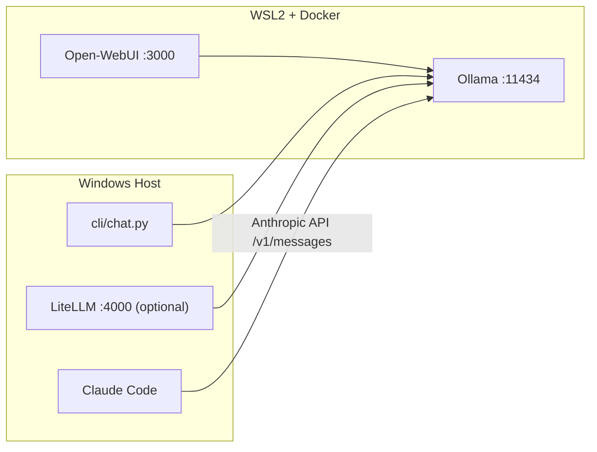

# Gemma 4 Local Setup

Local-first Gemma 4 stack on Windows + WSL2 + Docker, using Ollama as the inference backend.

## What this repository provides

- Ollama serving Gemma 4 models on `http://localhost:11434` (with native Anthropic API compatibility)
- Open-WebUI at `http://localhost:3000` — browser-based chat
- Claude Code connected directly to Ollama with full tool support (Bash, Read, Write, Glob, Grep, etc.)
- LiteLLM proxy on `http://localhost:4000` (optional, for OpenAI-compatible clients)
- Python terminal chat client at `cli/chat.py`
- PowerShell scripts to start, switch, and orchestrate the stack

## Architecture



---

## One-time setup

Complete these steps once before running the stack for the first time.

### Step 1 — Install prerequisites

Make sure all of the following are installed on your Windows machine:

| Tool | Purpose | Minimum version |
|---|---|---|
| Windows 10/11 | Host OS | — |
| NVIDIA driver | GPU passthrough | 535+ |
| [WSL2](https://learn.microsoft.com/en-us/windows/wsl/install) | Linux kernel for Docker | Latest |
| [Docker Desktop](https://www.docker.com/products/docker-desktop/) | Container runtime | — |
| [Anaconda or Miniconda](https://www.anaconda.com/download) | Python env for host tools | — |
| [Node.js](https://nodejs.org/) | Required for Claude Code | 18+ |
| [Git LFS](https://git-lfs.com/) | Large file tracking | — |

Enable **WSL2 backend** and **GPU support** in Docker Desktop settings before continuing.

### Step 2 — Configure WSL2 memory and CPU limits

Copy the sample WSL2 config to your user profile:

```powershell
Copy-Item configs\.wslconfig "$env:USERPROFILE\.wslconfig"
```

Then restart WSL2:

```powershell
wsl --shutdown
```

Edit `C:\Users\<you>\.wslconfig` to adjust `memory` and `processors` to your machine. See `docs/wsl2_setup.md` for details.

### Step 3 — Verify Docker GPU passthrough

```powershell
docker run --rm --gpus all nvidia/cuda:12.8.0-base-ubuntu22.04 nvidia-smi
```

You should see your GPU listed. If this fails, check Docker Desktop WSL2 + GPU settings.

### Step 4 — Create the conda environment

```powershell
conda env create -f environment.yml
```

This creates the `gemma_4_env` environment with LiteLLM and the CLI chat dependencies.

### Step 5 — Install Claude Code

```powershell
npm install -g @anthropic-ai/claude-code
```

### Step 6 — Install claude-launcher (recommended)

`claude-launcher` ensures all Claude Code role-model requests (Haiku, Sonnet, Opus) route to your local Ollama model instead of leaking to Anthropic's cloud:

```powershell
npm install -g claude-launcher
```

### Step 7 — Initialize Git LFS

```powershell
git lfs install
```

---

## Running the stack

### Terminal 1 — Start Ollama and pull the model

```powershell
.\scripts\start_ollama.ps1 -Model gemma4:26b
```

This starts the Ollama Docker container, waits for it to be ready, and pulls the model. The first run downloads ~18 GB — subsequent starts use the cached volume.

**Available model variants:**

| Model | VRAM | Notes |
|---|---|---|
| `gemma4:26b` | ~18 GB | 26B MoE, 3.8B active — best speed/quality (default) |
| `gemma4:31b` | ~20 GB | 31B dense — highest quality |
| `gemma4:e4b` | ~10 GB | 4B effective — fast iteration |
| `gemma4:e2b` | ~7 GB | 2B effective — lightest |

To start with a different model:

```powershell
.\scripts\start_ollama.ps1 -Model gemma4:31b
```

### Terminal 2 — Start Open-WebUI (optional browser chat)

```powershell
.\scripts\start_webui.ps1
```

Then open [http://localhost:3000](http://localhost:3000) in your browser.

### Terminal 2 — Start Claude Code

Run without arguments for an interactive model picker:

```powershell
.\scripts\start_claude_launcher.ps1
```

Or pass a model directly to skip the menu:

```powershell
.\scripts\start_claude_launcher.ps1 -Model gemma4:31b
```

Claude Code will open in your terminal with full tool support (Bash, Read, Write, Glob, Grep, etc.) backed by your local Gemma 4 model.

> `start_claude_launcher.ps1` uses `claude-launcher` which remaps all role models to your
> chosen local model. If you prefer the plain `claude` binary, use `start_claude_code.ps1`
> instead — same flags, same behavior, without role remapping.

---

## Switching model while the stack is running

```powershell
.\scripts\switch_model.ps1 -Model gemma4:31b
```

Then restart Claude Code with the new model:

```powershell
.\scripts\start_claude_launcher.ps1 -Model gemma4:31b
```

---

## CLI chat usage

Activate the conda environment, then:

```powershell
conda activate gemma_4_env
python .\cli\chat.py
```

Or with explicit options:

```powershell
python .\cli\chat.py --model gemma4:26b --base-url http://localhost:11434/v1
```

Slash commands inside the chat:

| Command | Description |
|---|---|
| `/exit` | Quit |
| `/clear` | Clear conversation history |
| `/model <name>` | Switch model mid-session |
| `/system <prompt>` | Set a system prompt |

---

## LiteLLM proxy (optional)

LiteLLM provides an OpenAI-compatible Anthropic-style endpoint. It is not needed for Claude Code but is useful for other clients.

```powershell
conda activate gemma_4_env
.\scripts\start_litellm.ps1
```

The proxy will be available at `http://localhost:4000` with key `sk-local-key`.

---

## Start everything at once

To start Ollama and Open-WebUI together:

```powershell
.\scripts\start_all.ps1 -Model gemma4:26b
```

Then launch Claude Code in a second terminal as described above.

---

## Verification checklist

After the stack is running, confirm each component works:

1. **Ollama API**
   ```powershell
   Invoke-RestMethod http://localhost:11434/api/tags
   ```
   Should return a JSON list containing your pulled model.

2. **Open-WebUI** — open [http://localhost:3000](http://localhost:3000) and send a test message.

3. **CLI chat**
   ```powershell
   conda activate gemma_4_env
   python .\cli\chat.py
   ```

4. **Claude Code tools** — inside Claude Code, run:
   ```
   > list the files in this directory
   ```
   Claude Code should execute a Bash or Glob tool call and return real results (not JSON text).

---

## Troubleshooting

- Ollama not starting: `docker compose logs -f ollama`
- Open-WebUI not loading: `docker compose logs -f open-webui`
- Claude Code outputs JSON instead of executing tools: make sure you are using `start_claude_launcher.ps1` or `start_claude_code.ps1`, not the old LiteLLM path
- Model not found: `docker exec gemma_4_local_setup-ollama-1 ollama list`
- More details: `docs/troubleshooting.md`

## Repository files

| Path | Description |
|---|---|
| `environment.yml` | `gemma_4_env` conda environment |
| `docker-compose.yml` | Ollama + Open-WebUI services |
| `configs/.wslconfig` | Sample WSL2 sizing/networking config |
| `configs/litellm_config.yaml` | LiteLLM model mapping (optional) |
| `scripts/start_ollama.ps1` | Start Ollama container and pull model |
| `scripts/start_webui.ps1` | Start Open-WebUI container |
| `scripts/start_all.ps1` | Start Ollama + Open-WebUI together |
| `scripts/start_claude_code.ps1` | Launch Claude Code via Ollama |
| `scripts/start_claude_launcher.ps1` | Launch Claude Code with full role remapping |
| `scripts/start_litellm.ps1` | Start LiteLLM proxy (optional) |
| `scripts/switch_model.ps1` | Switch active Gemma 4 variant |
| `cli/chat.py` | OpenAI-compatible streaming terminal chat |
| `docs/` | Architecture, decisions, troubleshooting, WSL2 setup |
