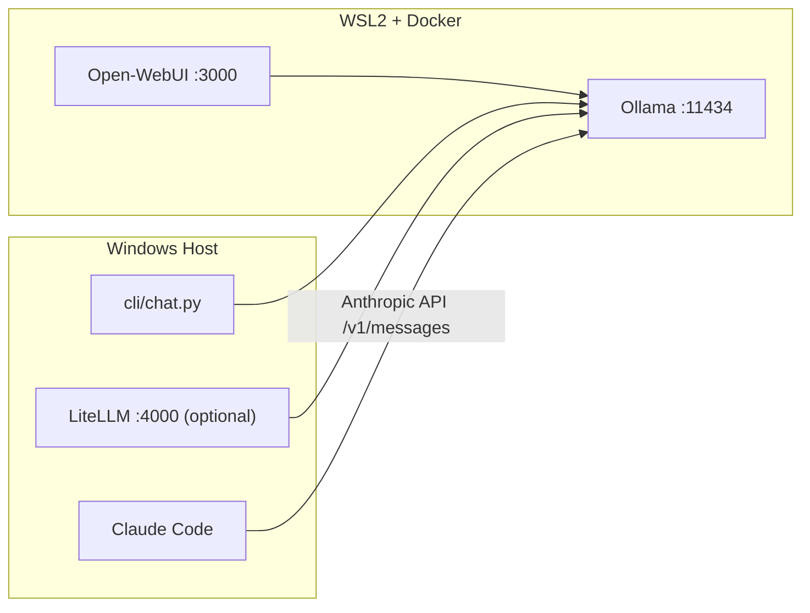

# Gemma 4 Local Setup

Local-first Gemma 4 stack on Windows + WSL2 + Docker, using Ollama as the inference backend.

## What this repository provides

- Ollama serving Gemma 4 models on `http://localhost:11434` (with native Anthropic API compatibility)
- Open-WebUI at `http://localhost:3000`
- Claude Code connected directly to Ollama with full tool support (Bash, Read, Write, Glob, Grep, etc.)
- LiteLLM proxy on `http://localhost:4000` (optional, for OpenAI-compatible clients)
- Python terminal chat client at `cli/chat.py`
- PowerShell scripts to start, switch, and orchestrate the stack

## Architecture



## Prerequisites

1. Windows 10/11 with NVIDIA driver (535+ recommended).
2. WSL2 installed and updated.
3. Docker Desktop with WSL2 backend and GPU support enabled.
4. Conda (Miniconda/Anaconda) for host-side tooling.

## Repository files

- `.gitattributes`: Git LFS tracking for model/engine binaries
- `environment.yml`: `gemma_4_env` definition
- `docker-compose.yml`: Ollama + Open-WebUI services
- `configs/.wslconfig`: sample WSL2 sizing/networking config
- `configs/litellm_config.yaml`: LiteLLM model mapping
- `scripts/*.ps1`: startup and orchestration scripts
- `cli/chat.py`: OpenAI-compatible streaming CLI chat
- `docs/`: architecture, decisions, troubleshooting, WSL2 setup

## Setup

### 1) Git LFS

Install Git LFS, then run:

```powershell
git lfs install
```

### 2) Create conda environment

```powershell
conda env create -f environment.yml
conda activate gemma_4_env
```

### 3) Configure WSL2

Copy `configs/.wslconfig` to your user profile path:

`C:\Users\<your-user>\.wslconfig`

Then run:

```powershell
wsl --shutdown
```

Detailed steps: `docs/wsl2_setup.md`

### 4) Verify Docker GPU passthrough

```powershell
docker run --rm --gpus all nvidia/cuda:12.8.0-base-ubuntu22.04 nvidia-smi
```

## Running the stack

### Start Ollama and pull model

```powershell
.\scripts\start_ollama.ps1 -Model gemma4:26b
```

### Start Open-WebUI

```powershell
.\scripts\start_webui.ps1
```

Then open [http://localhost:3000](http://localhost:3000).

### Start all Docker-backed components

```powershell
.\scripts\start_all.ps1 -Model gemma4:26b
```

### Switch model variant

```powershell
.\scripts\switch_model.ps1 -Model gemma4:31b
```

Supported values:

- `gemma4:31b` -- 31B dense, highest quality
- `gemma4:26b` -- 26B MoE (3.8B active), best speed/quality tradeoff (default)
- `gemma4:e4b` -- 4B effective, fast iteration
- `gemma4:e2b` -- 2B effective, lightest

## CLI chat usage

Run from activated `gemma_4_env`:

```powershell
python .\cli\chat.py
```

Or with explicit options:

```powershell
python .\cli\chat.py --model gemma4:26b --base-url http://localhost:11434/v1
```

Slash commands:

- `/exit`
- `/clear`
- `/model <name>`
- `/system <prompt>`

## Claude Code (direct Ollama connection)

Ollama v0.14+ supports the Anthropic Messages API natively, so Claude Code connects
directly to Ollama with full tool support (Bash, Read, Write, Glob, Grep, etc.) — no
translation layer needed.

```powershell
.\scripts\start_claude_code.ps1
```

Or with a different model variant:

```powershell
.\scripts\start_claude_code.ps1 -Model gemma4:31b
```

This sets:

- `ANTHROPIC_BASE_URL=http://localhost:11434`
- `ANTHROPIC_AUTH_TOKEN=ollama`
- `ANTHROPIC_API_KEY=""` (prevents calls to Anthropic cloud)

### With claude-launcher (recommended for full role remapping)

Claude Code routes tasks to different role models (Haiku/Sonnet/Opus).
`claude-launcher` remaps all roles to your chosen Ollama model so every request stays local:

```powershell
npm install -g claude-launcher   # one-time install
.\scripts\start_claude_launcher.ps1
```

Or with a specific model:

```powershell
.\scripts\start_claude_launcher.ps1 -Model gemma4:31b
```

## LiteLLM proxy (optional)

LiteLLM is still available for OpenAI-compatible clients that need an Anthropic-style
endpoint. It is no longer required for Claude Code.

```powershell
conda activate gemma_4_env
.\scripts\start_litellm.ps1
```

## Verification checklist

1. `Invoke-RestMethod http://localhost:11434/api/tags` returns model list.
2. Open-WebUI loads and can complete a prompt.
3. `python .\cli\chat.py` streams responses.
4. Claude Code can execute tools (Bash, Read, Write) through Ollama.
5. (Optional) LiteLLM is reachable at `http://localhost:4000`.

## Troubleshooting

- Ollama issues: `docker compose logs -f ollama`
- Open-WebUI issues: `docker compose logs -f open-webui`
- LiteLLM issues: check startup output and `configs/litellm_config.yaml`
- More details: `docs/troubleshooting.md`
