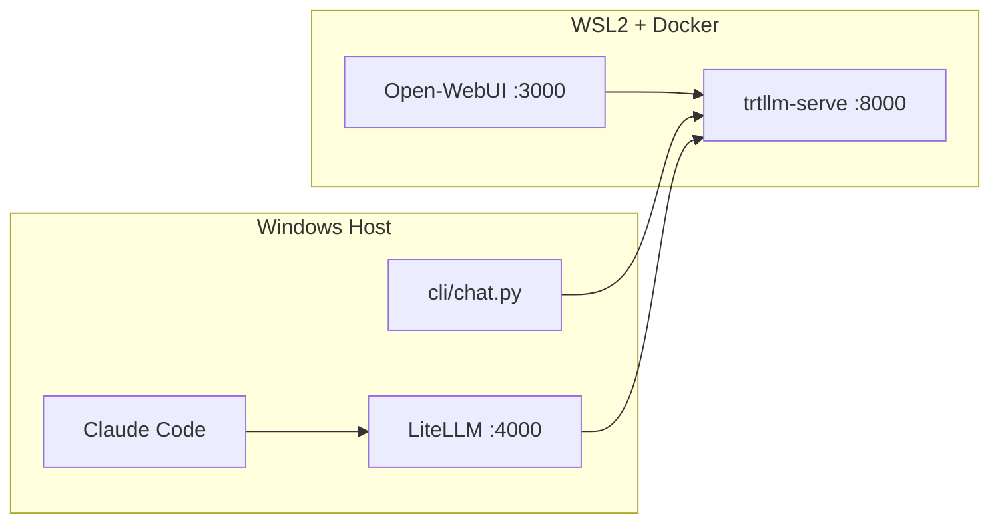

# Gemma 4 Local Setup

Local-first Gemma 4 stack on Windows + WSL2 + Docker, using TensorRT-LLM as the single inference backend.

## What this repository provides

- TensorRT-LLM serving (`trtllm-serve`) for Gemma 4 models on `http://localhost:8000/v1`
- Open-WebUI at `http://localhost:3000`
- LiteLLM proxy on `http://localhost:4000` to bridge Claude Code (Anthropic API) to local OpenAI-compatible backend
- Python terminal chat client at `cli/chat.py`
- PowerShell scripts to start, switch, and orchestrate the stack

## Architecture



## Prerequisites

1. Windows 10/11 with NVIDIA driver (535+ recommended).
2. WSL2 installed and updated.
3. Docker Desktop with WSL2 backend and GPU support enabled.
4. Conda (Miniconda/Anaconda) for host-side tooling.
5. HuggingFace token (`HF_TOKEN`) if the selected model requires gated access.

## Repository files

- `.gitattributes`: Git LFS tracking for model/engine binaries
- `environment.yml`: `gemma_4_env` definition
- `docker-compose.yml`: TensorRT-LLM + Open-WebUI services
- `configs/.wslconfig`: sample WSL2 sizing/networking config
- `configs/litellm_config.yaml`: LiteLLM model mapping
- `scripts/*.ps1`: startup and orchestration scripts
- `cli/chat.py`: OpenAI-compatible streaming CLI chat
- `docs/`: architecture, decisions, troubleshooting, WSL2 setup

## Setup

### 1) Git LFS

Install Git LFS, then run:

```powershell
git lfs install
```

### 2) Create conda environment

```powershell
conda env create -f environment.yml
conda activate gemma_4_env
```

### 3) Configure WSL2

Copy `configs/.wslconfig` to your user profile path:

`C:\Users\<your-user>\.wslconfig`

Then run:

```powershell
wsl --shutdown
```

Detailed steps: `docs/wsl2_setup.md`

### 4) Verify Docker GPU passthrough

```powershell
docker run --rm --gpus all nvidia/cuda:12.8.0-base-ubuntu22.04 nvidia-smi
```

### 5) Set model and optional token

Create a local `.env` file in repo root:

```dotenv
MODEL_ID=google/gemma-4-26B-A4B-it
HF_TOKEN=your_hf_token_if_needed
```

## Running the stack

### Start TensorRT-LLM only

```powershell
.\scripts\start_trtllm.ps1 -Model google/gemma-4-26B-A4B-it
```

### Start Open-WebUI

```powershell
.\scripts\start_webui.ps1
```

Then open [http://localhost:3000](http://localhost:3000).

### Start all Docker-backed components

```powershell
.\scripts\start_all.ps1 -Model google/gemma-4-26B-A4B-it
```

### Switch model variant

```powershell
.\scripts\switch_model.ps1 -Model google/gemma-4-31B-it
```

Supported values:

- `google/gemma-4-31B-it`
- `google/gemma-4-26B-A4B-it`
- `google/gemma-4-E4B-it`

## CLI chat usage

Run from activated `gemma_4_env`:

```powershell
python .\cli\chat.py --model google/gemma-4-26B-A4B-it --base-url http://localhost:8000/v1
```

Slash commands:

- `/exit`
- `/clear`
- `/model <name>`
- `/system <prompt>`

## Claude Code via LiteLLM

1. Start LiteLLM:

```powershell
conda activate gemma_4_env
.\scripts\start_litellm.ps1
```

2. In another shell, start Claude Code with local endpoint:

```powershell
.\scripts\start_claude_code.ps1
```

This sets:

- `ANTHROPIC_BASE_URL=http://localhost:4000`
- `ANTHROPIC_AUTH_TOKEN=sk-local-key`

## Verification checklist

1. `Invoke-RestMethod http://localhost:8000/v1/models` returns model list.
2. Open-WebUI loads and can complete a prompt.
3. `python .\cli\chat.py` streams responses.
4. LiteLLM is reachable at `http://localhost:4000`.
5. Claude Code can run prompts through LiteLLM.

## Troubleshooting

- TensorRT-LLM issues: `docker compose logs -f trtllm`
- Open-WebUI issues: `docker compose logs -f open-webui`
- LiteLLM issues: check startup output and `configs/litellm_config.yaml`
- More details: `docs/troubleshooting.md`
