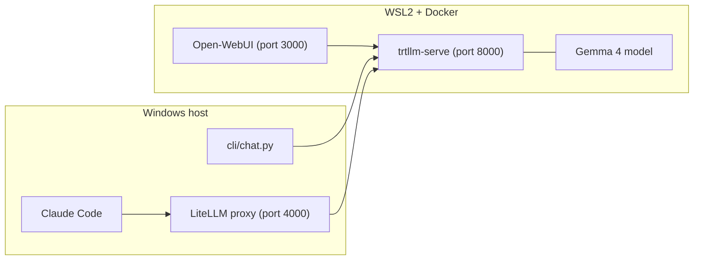

# Architecture

## Overview

This project runs TensorRT-LLM as the only inference backend for Gemma 4 models and exposes it to three clients:

- Open-WebUI (browser chat)
- `cli/chat.py` (terminal chat)
- Claude Code (through LiteLLM Anthropic-compatible bridge)

## Component Diagram

## Ports and Interfaces

- `8000`: `trtllm-serve` OpenAI-compatible endpoint (`/v1/*`)
- `3000`: Open-WebUI web app
- `4000`: LiteLLM endpoint for Anthropic-compatible clients

## Runtime Layout

- Docker/WSL2:
  - `trtllm` service (GPU-enabled)
  - `open-webui` service
- Windows host:
  - Python environment (`gemma_4_env`)
  - LiteLLM process
  - CLI and Claude Code

## Request Flow

1. User sends a prompt from UI/CLI/Claude Code.
2. Claude Code requests route through LiteLLM; UI/CLI call TensorRT-LLM directly.
3. TensorRT-LLM performs inference on GPU and streams response tokens.
4. Client receives and renders the response.
