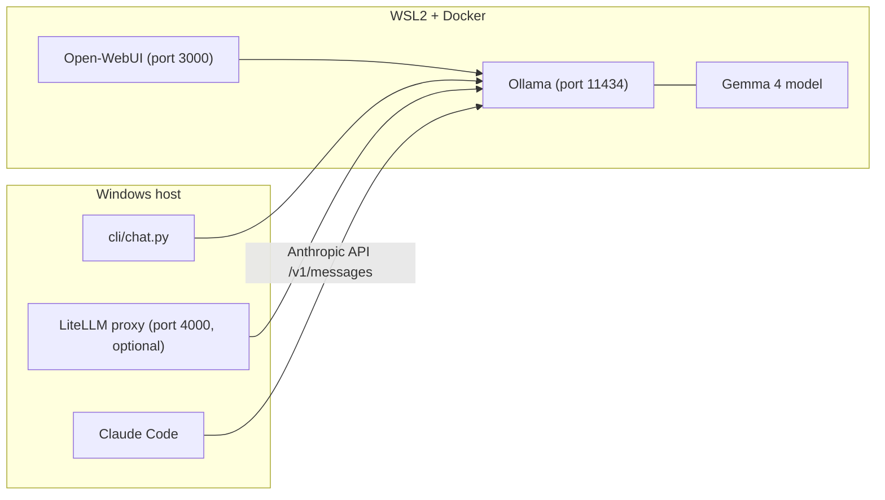

# Architecture

## Overview

This project runs Ollama as the inference backend for Gemma 4 models and exposes it to three clients:

- Open-WebUI (browser chat)
- `cli/chat.py` (terminal chat)
- Claude Code (direct connection via Ollama's native Anthropic API)

LiteLLM is available as an optional proxy for OpenAI-compatible clients.

## Component Diagram

## Ports and Interfaces

- `11434`: Ollama API (native + OpenAI-compatible at `/v1/` + Anthropic-compatible at `/v1/messages`)
- `3000`: Open-WebUI web app
- `4000`: LiteLLM endpoint (optional, for OpenAI-compatible clients)

## Runtime Layout

- Docker/WSL2:
  - `ollama` service (GPU-enabled)
  - `open-webui` service
- Windows host:
  - Python environment (`gemma_4_env`)
  - LiteLLM process (optional)
  - CLI and Claude Code

## Request Flow

### Claude Code (primary path)

1. User sends a prompt in Claude Code.
2. Claude Code sends an Anthropic Messages API request (with `tools` definitions) directly to Ollama at `http://localhost:11434/v1/messages`.
3. Ollama performs inference and returns structured `tool_use` content blocks.
4. Claude Code executes the tool (Bash, Read, Write, etc.) locally and sends a `tool_result` back.
5. The loop continues until the task is complete.

### Open-WebUI / CLI chat

1. User sends a prompt from the UI or CLI.
2. Request goes directly to Ollama's chat API.
3. Ollama performs inference on GPU via llama.cpp and streams response tokens.
4. Client receives and renders the response.

## Claude Code Role Model Routing

Claude Code assigns different "roles" to requests (Haiku for quick tasks, Sonnet for coding, Opus for reasoning). Without `claude-launcher`, only the primary model is set and other roles may fail. `claude-launcher` remaps all roles to the configured Ollama model.
